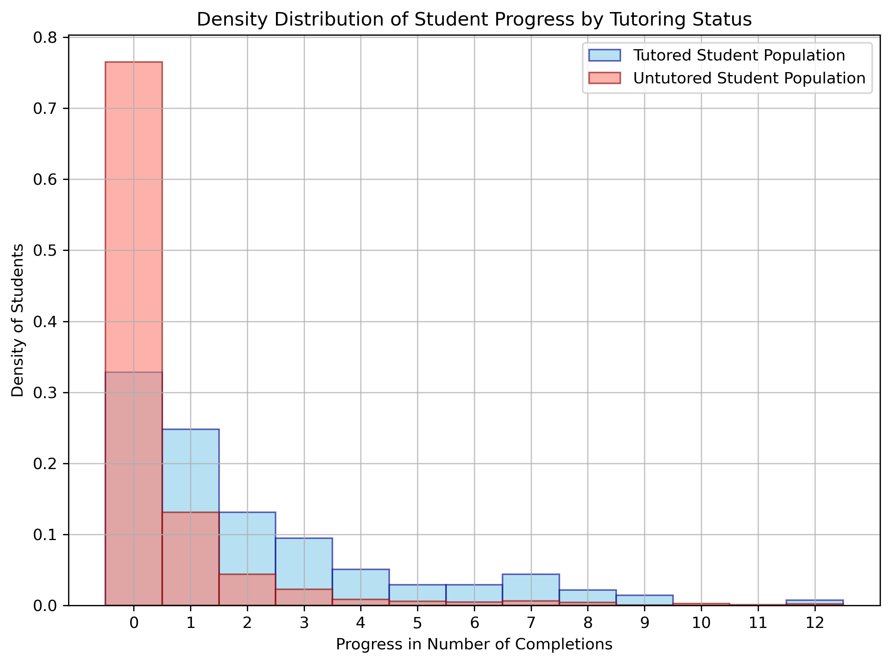

# Impact Analysis Using Statistical Modeling

## Executive Summary

Statistical analysis demonstrating 2.16x improvement in program effectiveness through targeted intervention. Using Zero-Inflated Negative Binomial regression on 2,558 participants, this project quantifies the impact of support programs on user engagement and success metrics.

**Key Impact**: 44% reduction in user disengagement (77% → 33% zero completions)

<p align="center">
  
</p>
<p align="center"><i>Density distribution showing dramatic reduction in disengagement with intervention</i></p>

## Business Problem

An online educational platform needed to evaluate the ROI of their peer support program to make data-driven decisions about resource allocation. Key questions:
- Does the intervention program justify its cost?
- Which user segments benefit most from support?
- How can we optimize program targeting?

## Methodology

### Data Pipeline
1. **Data Integration**: Merged intervention records (449 sessions) with user progress data (2,558 users)
2. **Statistical Modeling**: Applied ZINB regression to handle zero-inflated count data
3. **Validation**: Bootstrap analysis and permutation testing for robust results

### Analysis Notebooks
- [Data Wrangling - Intervention Records](notebooks/DA_2025Q1_1a_post_tutor_form_wrangling_mkw.ipynb)
- [Data Wrangling - User Progress](notebooks/DA_2025Q1_1b_gradebook_wrangling_mkw.ipynb)
- [Statistical Modeling & Testing](notebooks/DA_2025Q1_2_statistical_modeling_mkw.ipynb)

## Technical Skills Demonstrated
- **Data Wrangling & Integration**: Complex data cleaning, validation, and transformation across multiple sources
- **Exploratory Data Analysis (EDA)**: Patterns and trends identification via Statistical methods and visualizations
- **Statistical Analysis & Modeling**: Zero-Inflated Negative Binomial (ZINB) regression, hypothesis testing, bootstrap methods
- **Python Stack**: Pandas, numpy, scipy, statsmodels, matplotlib, seaborn
- **Best Practices**: Reproducible analysis via environment management and Black code formatting
- **Business Communication**: Executive presentations, actionable insights

## Results & Business Recommendations

### Quantified Impact
- **2.16x improvement** in completion rates (IRR: 2.16, 95% CI: [1.56, 3.01], p < 0.00001)
- **Clear positive ROI** based on improved user engagement metrics

### Strategic Segments Identified
    
| Segment                     | Description                                  | Action               |
|-----------------------------|----------------------------------------------|----------------------|
| **High Responders (67%)**   | Tutored students showing clear progress      | Continue support     |
| **Opportunity Group (33%)** | Tutored students with no progress            | Target intervention  |
| **Self-Starters (23%)**     | Untutored students progressing independently | No action needed     |
| **At-Risk Group (77%)**     | Untutored students with zero progress        | Prioritize outreach  |

### Recommendations
1. **Target intervention** for Opportunity Group for quick win
2. **Maintain current support** for High Responders
3. **Expand program** to At-Risk Group via continued outreach

### Deliverables
- [Executive Presentation (PDF)](presentations/Calbright_Data_Analysis_Tutoring_Effect_Evaluation_2025Q1_MKW.pdf)
- [Interactive Executive Presentation with Notes (Google Slides)](https://docs.google.com/presentation/d/1XuSMRpGwxlzaQ8unsDDhAwWEUM7NEmPTf7Ub73tAdzI/edit?usp=sharing)
- [Statistical Model Metrics](data_modeling_output/zinb_model_metrics_2025Q1.csv)
- [Statistical Tests Summary](data_modeling_output/statistical_test_summary_2025Q1.csv)
- [Main Outputs](data_modeling_output/)

## Next Steps

1. **Predictive Model**: Develop early warning system to identify at-risk users
2. **A/B Testing**: Test targeted intervention for Opportunity Group
3. **Dashboard**: Real-time monitoring of segment movements
4. **Scale Analysis**: Apply framework to other programs/interventions

## Repository Structure
```
├── raw_data/                # README only (data excluded for privacy)
├── notebooks/               # Analysis notebooks with full methodology
├── data_wrangling_output/   # README only (data excluded for privacy)
├── data_modeling_output/    # Visualizations, statistical modeling and tests results
├── presentations/           # Stakeholder communications
├── README.md                # Project overview and results
├── .gitignore               # Excludes sensitive data files
└── requirements.txt         # Environment specifications
```

## Data Privacy Note

All data files containing participant information have been excluded from this repository to protect privacy. Raw data and processed datasets are not included in this public repository - see individual folder READMEs for data descriptions.

The notebooks demonstrate the complete analysis process and results without exposing sensitive information. To reproduce this analysis, you would need:

- Intervention tracking data with participant identifiers
- Progress/engagement data from the platform system  
- Proper data access permissions and compliance approval

## Contact
[Masae Kobayashi Wen] - [mkwen2024@gmail.com] - [[LinkedIn](https://www.linkedin.com/in/masae-kobayashi-wen-42241a13/)]